# Отчёт по результатам тестирования на проникновение инфраструктуры компании


**Заказчик: Any company**

**Исполнитель: V.A. Fominov**

## Шаг 1

В первую очередь проведем анализ инфраструктуры подсети 10.0.20.0/24 для дальнейшей работы. Для этого выполним первичное сканирование портов с помощью программы nmap чтобы определить, какие сервисы на каких портах расположены:

Стандартное сканирование без использования дополнительных опций:

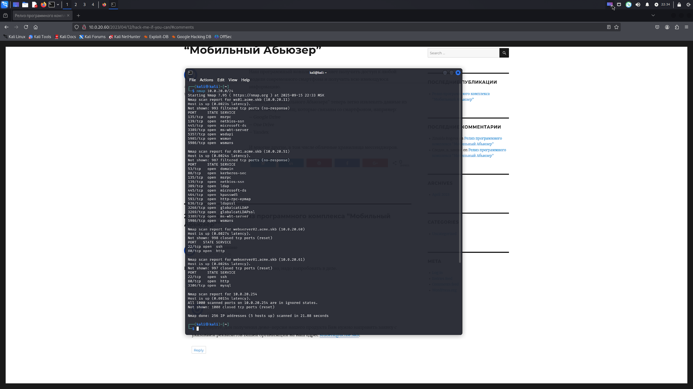

Сканирование с опциями -sV (определение служб на портах и их версий), -A (определение с помощью встроенных скриптов ОС и их версий) и -p- (данная опция позволяет провести сканирование по всем 65.535 портам):

**Команда выглядит следующим образом: nmap -sV -A -p- 10.0.20.0/24:**


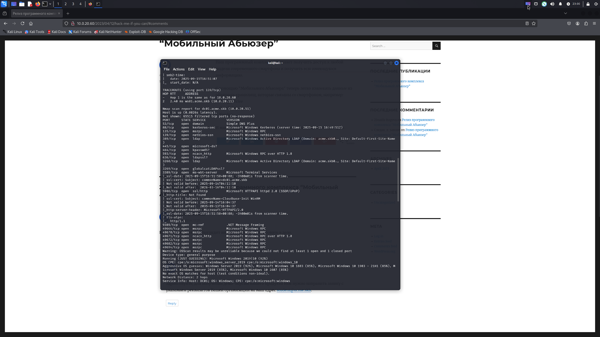

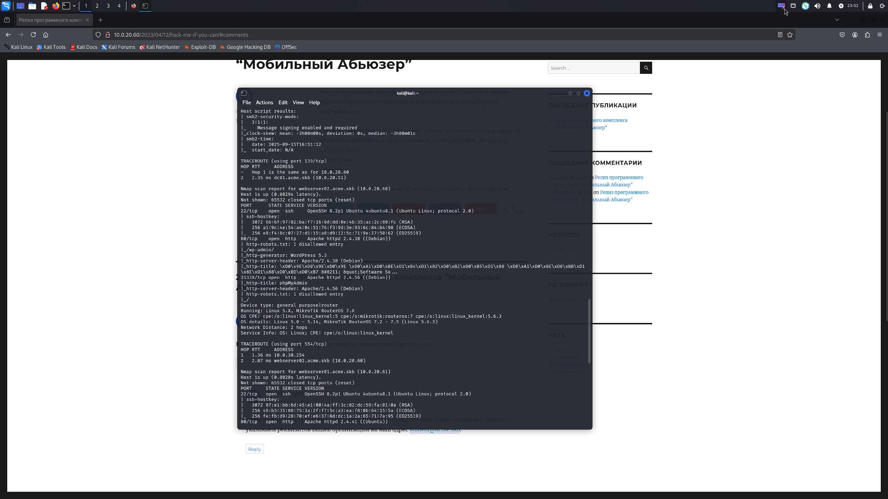

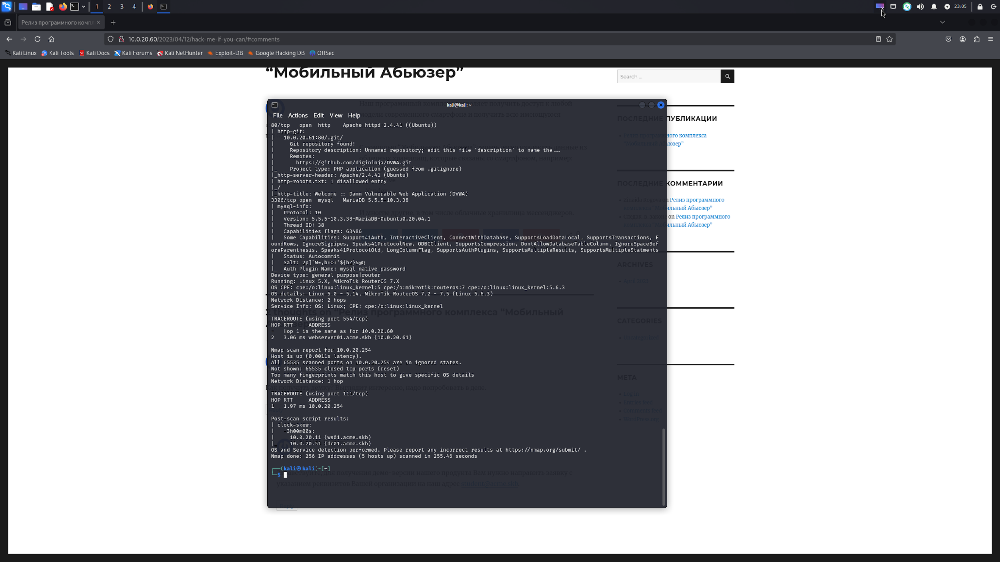

### Описание результатов сканирования:

### Хост 1:

- Имя хоста: ws01.acme.skb

- IP: 10.0.20.11

- ОС: Microsoft Windows 2019|10 (92%)

- Открытые порты, ПО (название, версия и другая информация):

| Номер открытого порта | Название сервиса | Версия сервиса | Доп. информация |
| --- | --- | --- | --- |
| 135 | msrpc | Microsoft Windows RPC |   |
| 139 | netbios-ssn | Microsoft Windows netbios-ssn | Служба, обеспечивающая связь по локальной сети LAN. Установлен порт по умолчанию. |
| 445 | microsoft-ds |   | Порт связан с протоколом SMB (исп. для управления доступом к файлам, каталогам и т.п.) |
| 3389 | ms-wbt-server | Microsoft Terminal Services | Сервер протокола RDP.<br>Выдан ssl-сертификат ws01.acme.skb |
| 5357 | wsdapi | Microsoft HTTPAPI httpd 2.0 (SSDP/UPnP) |   |
| 5985 | wsman | Microsoft HTTPAPI httpd 2.0 (SSDP/UPnP) |   |
| 5986 | wsmans | Microsoft HTTPAPI httpd 2.0 (SSDP/UPnP) |   |
| 47001 | winrm | Microsoft HTTPAPI httpd 2.0 (SSDP/UPnP) |   |
| 49664 | msrpc | Microsoft Windows RPC |   |
| 49665 | msrpc | Microsoft Windows RPC |   |
| 49666 | msrpc | Microsoft Windows RPC |   |
| 49667 | msrpc | Microsoft Windows RPC |   |
| 49668 | msrpc | Microsoft Windows RPC |   |
| 49670 | msrpc | Microsoft Windows RPC |   |
| 49671 | msrpc | Microsoft Windows RPC |   |
| 49673 | msrpc | Microsoft Windows RPC |   |

### Хост 2:

- Имя хоста: dc01.acme.skb

- IP: 10.0.20.51

- ОС: Microsoft Windows 2019|10 (92%)

- Открытые порты, ПО (название, версия и другая информация):

| Номер открытого порта | Название сервиса | Версия сервиса | Доп. информация |
| --- | --- | --- | --- |
| 53 | domain | Simple DNS Plus | На хосте поднят DNS-сервер. Порт по умолчанию для службы DNS. |
| 88 | kerberos-sec | Microsoft Windows Kerberos | Порт по умолчанию для протокола аутентификации Kerberos. |
| 135 | msrpc | Microsoft Windows RPC |   |
| 139 | netbios-ssn | Microsoft Windows netbios-ssn | Служба, обеспечивающая связь по локальной сети LAN. Установлен порт по умолчанию. |
| 389 | ldap | Microsoft Windows Active Directory LDAP (Domain: acme.skb0) | Стандартный порт протокола LDAP. |
| 445 | microsoft-ds |   | Порт связан с протоколом SMB (исп. для управления доступом к файлам, каталогам и т.п.) |
| 464 | kpasswd5 |   | Порт по умолчанию для сервиса изменения паролей в AD. Есть уязвимость. |
| 593 | http-rpc-epmap | Microsoft Windows RPC over HTTP 1.0 | Сервис обесп. связь между приложениями в сети с исп. протоколов HTTP и RPC. |
| 636 | ldapssl |   | Порт по умолчанию для протокола LDAPS (LDAP с SSL/TLS) |
| 3268 | globalcatLDAP | Microsoft Windows Active Directory LDAP (Domain: acme.skb0) | Эта служба позволяет быстро искать объекты во всём лесу AD с помощью LDAP. Исп. на контроллерах доменов. |
| 3269 | globalcatLDAPssl |   | Порт по умолчанию для данного сервиса. Исп. протокол SSL. |
| 3389 | ms-wbt-server | Microsoft Terminal Services | Сервер протокола RDP. |
| 5357 | wsdapi |   |   |
| 5985 | wsman |   |   |
| 5986 | wsmans | Microsoft HTTPAPI httpd 2.0 (SSDP/UPnP) |   |
| 9389 | mc-nmf | .NET Message Framing | Порт по умолчанию. |
| 49666 | msrpc | Microsoft Windows RPC |   |
| 49670 | msrpc | Microsoft Windows RPC |   |
| 49671 | ncacn_http | Microsoft Windows RPC over HTTP 1.0 |   |
| 49672 | msrpc | Microsoft Windows RPC |   |
| 49682 | msrpc | Microsoft Windows RPC |   |
| 49694 | msrpc | Microsoft Windows RPC |   |

### Хост 3:

- Имя хоста: webserver02.acme.skb

- IP: 10.0.20.60

- ОС: Linux 5.0 - 5.14, MikroTik RouterOS 7.2 - 7.5 (Linux 5.6.3)

- Открытые порты, ПО (название, версия и другая информация):

| Номер открытого порта | Название сервиса | Версия сервиса | Доп. информация |
| --- | --- | --- | --- |
| 22 | ssh | OpenSSH 8.2p1 Ubuntu 4ubuntu0.1 (Ubuntu Linux; protocol 2.0) | Порт по умолчанию для службы SSH. |
| 80 | WordPress | Apache httpd 2.4.38 (Debian) | Порт по умолчанию для протокола HTTP. Не зашифрован и уязвим.<br>Файл robots.txt исключает поиск директории /wp-admin/<br>CMS WordPress 5.3 |
| 31338 | phpAdmin | Apache httpd 2.4.56 (Debian) | Админ панель phpAdmin для СУБД MySQL. Файл robots.txt исключает поиск директории / |

### Хост 4:

- Имя хоста: webserver01.acme.skb

- IP: 10.0.20.61

- ОС: Linux 5.0 - 5.14, MikroTik RouterOS 7.2 - 7.5 (Linux 5.6.3)

- Открытые порты, ПО (название, версия и другая информация):

| Номер открытого порта | Название сервиса | Версия сервиса | Доп. информация |
| --- | --- | --- | --- |
| 22 | ssh | OpenSSH 8.2p1 Ubuntu 4ubuntu0.1 (Ubuntu Linux; protocol 2.0) | Порт по умолчанию для службы SSH. |
| 80 | http | Apache httpd 2.4.41 (Ubuntu) | Порт по умолчанию для протокола HTTP. Не зашифрован и уязвим.<br>Git-репозиторий по адресу 10.0.20.61:80/.git/ (https://github.com/digininja/DVWA.git), следовательно, на этом порту находится уязвимая машина DVWA.<br>Файл robots.txt исключает поиск директории / |
| 3306 | mysql | MariaDB 5.5.5-10.3.38 | Стандартный порт для серверов баз данных MySQL.<br>Соль: 2p]`M=,b+O+`${bZ}&@Q |

## Шаг 2

Проведем анализ сайта [http://softwaresolutions.acme.skb/](http://softwaresolutions.acme.skb/) на наличие чувствительной и полезной для атакующей стороны информации.

Проверим, доступен ли данный сайт и узнаем его IP-адрес:

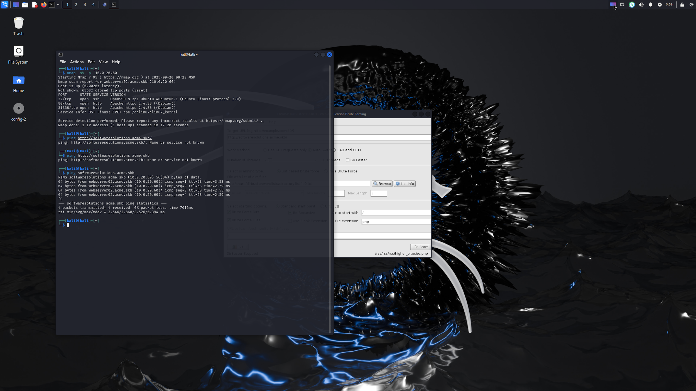

Как мы видим, IP-адрес 10.0.20.60 соответствует IP-адресу хоста webserver02.acme.skb. Следовательно, веб-сайт [http://softwaresolutions.acme.skb/](http://softwaresolutions.acme.skb/) находится на данном веб-сервере.

### Описание результатов изучения веб-сайта:

| Локализация информации | Найденная информация |
| --- | --- |
| http://10.0.20.60/2023/04/12/hack-me-if-you-can/#comments | Комментарий с указанием email-адреса организации - student@acme.skb.<br>ФИО сотрудника, который написал комментарий - Zinaida Rogova<br>Есть форма для отправки комментариев. |
| http://10.0.20.60/wp-login.php | Форма ввода логин/пароль.<br>При вводе пары admin/admin видим email-адрес администратора - admin@example.com.<br>При подтверждении email-адреса получаем доступ к административной панели! |
| http://10.0.20.60/contacts/ | Адрес организации.<br>Активная кнопка Edit, которая дает доступ на админ. панель. |
| http://softwaresolutions.acme.skb/ | Форма для поиска информации на сайте.<br>В разделе META при нажатии на ссылки Entries feed и Comments feed загружаются файлы RSS  в формате XML.<br>Есть понимание, что сайт сделан с помощью CMS WordPress. |
| http://10.0.20.60/wp-admin/ | Административная панель сайта. |
| http://10.0.20.60/wp-admin/users.php | Список всех пользователей сайта – admin, Buh, editor.<br>Email-адрес сотрудника бухгалтерии Zinaida Rogova - hackmeagain@unhackbl.org.<br>Третий пользователь сайта, кроме Admin и Buh – Editor. Его email-адрес editor@yourdomain.com. |

В результате анализа сайта удалось получить доступ к административной панели из-за стандартной пары логин:пароль, что обеспечивает полный контроль над сайтом. Также удалось выяснить, что сайт сделан в CMS WordPress, что дает дополнительные возможности для атакующей стороны.

## Шаг 3

Просканируем сайт сканером уязвимостей OpenVAS (современное название GVM - Greenbone Vulnerability Management) и проанализируем информацию об обнаруженных уязвимостях. После окончания сканирования установим фильтр QoD в сканере на 30% для более подробного отчета и сформируем его.

Всего было обнаружено 44 уязвимости высокого, 40 уязвимостей среднего и 4 уязвимости низкого уровней угроз.

### Обнаруженные уязвимости:

| ID уязвимости | Краткое описание | Уровень угрозы / CVSS | Потенциальные риски |
| --- | --- | --- | --- |
| CVE-2020-15778 | Уязвимость позволяет удалённому нарушителю выполнить произвольную команду на целевой системе из-за отсутствия фильтрации специальных символов. | High / 7.8 | Возможность удалённого выполнения кода, что может привести к полной компрометации сервера, утечке данных или нарушению его работы. |
| CVE-2002-20001 /<br>CVE-2022-40735 | Обе уязвимости связаны с возможностью проведения DoS-атак за счёт слишком дорогостоящих вычислений на сервере при процессе обмена ключами Diffie-Hellman. | High / 7.5 | DoS-атаки. |
| CVE-2021-28041 | Уязвимость, связанная с ошибкой двойного освобождения памяти (double free). Позволяет удалённому атакующему вызвать отказ в обслуживании (DoS) или выполнить произвольный код, используя память после её освобождения. | High / 7.1 | Компрометация конфиденциальности, целостности и доступности защищаемой информации, что может привести к нарушению работы ssh-сессий и возможному удалённому выполнению кода. |
| CVE-2021-41617 | Уязвимость в OpenSSH, связанная с неправильным управлением группами, в результате чего вспомогательные программы могут запускаться с повышенными привилегиями | High / 7.0 | Возможность злоумышленнику получить доступ к конфиденциальным данным, нарушить их целостность или вызвать отказ в обслуживании. |
| - | Срок службы версии PHP на хосте истек. | High / 10.0 | Использование PHP версий с истёкшим сроком поддержки несёт риск уязвимостей, которые могут быть использованы злоумышленниками для выполнения атак, компрометации данных и нарушения работы приложений на сервере. |
| CVE-2021-44790 | Уязвимость переполнения буфера в Apache HTTP Server (mod_lua), которая может привести к удалённому выполнению произвольного кода или отказу в обслуживании. | High / 9.8 | Компрометация сервера, утечка данных и нарушение его работы. |
| 1. CVE-2018-19296<br>2. CVE-2020-36326 | 1. уязвимость в библиотеке PHPMailer, позволяющая злоумышленнику выполнить PHP Object Injection через обработку вложений с использованием phar:// путей.<br>2. Уязвимость в PHPMailer, связанная с недостаточной проверкой пользовательских данных | High / 9.8 | 1. Компрометацией сервера и нарушением безопасности веб-приложений.<br>2. Удалённое выполнение кода и атаки на веб-серверы с использованием уязвимых версий данной библиотеки. |
| CVE-2019-16773<br>CVE-2019-16780<br>CVE-2019-16781<br>CVE-2019-16788<br>CVE-2019-20041<br>CVE-2019-20042<br>CVE-2019-20043 | Уязвимости в WordPress до версии 5.3.1, позволяющие пользователям с низкими правами (например, редакторам или контрибьюторам) внедрять JavaScript код через редактор блоков и уязвимости, связанные с неправильной обработкой пакетов TCP (например, MSS и SACK) в Linux ядре | High / 9.8 | Компрометация учётных записей, нарушение целостности контента и возможность проведения атак с использованием прав администратора, а также отказ в обслуживании (DoS) или замедление работы сети при отправке специально сформированных пакетов. |
| 1. CVE-2020-35452<br>2. CVE-2021-26690<br>3. CVE-2021-26691 | 1. Уязвимость переполнения стека в компоненте mod_auth_digest Apache HTTP Server версии до 2.4.46, вызванная специально сформированным Digest nonce.<br>2. Ошибка обработки заголовков cookie в mod_session Apache HTTP Server до 2.4.46.<br>3. Уязвимость переполнения данных в Apache HTTP Server версии до 2.4.46 из-за специально сформированного SessionHeader. | High / 9.8 | 1. Может привести к нарушению конфиденциальности, целостности данных и отказу в обслуживании.<br>2. Вызывает сбой и отказ в обслуживании из-за отклонения нулевого указателя. В результате атакующий может нарушить доступность сервера.<br>3. Отказ в обслуживании и потенциальное нарушение нормальной работы сервера. |
| CVE-2021-21708 | Уязвимость use-after-free в функции php_filter_float() интерпретатора PHP. | High / 9.8 | Отказ в обслуживании или выполнение произвольного кода. |
| 1. CVE-2022-22719<br>2. CVE-2022-22720<br>3. CVE-2022-22721<br>4. CVE-2022-23943 | 1. Уязвимость в модуле mod_lua Apache HTTP Server версии 2.4.52 и ранее, когда специально сформированное тело запроса может вызвать чтение случайной области памяти, что приводит к аварийному завершению процесса сервера.<br>2. Ошибка в обработке HTTP/2 заголовков в Apache 2.4.52 и ниже, приводящая к аварийному завершению сервера.<br>3. Уязвимость обработки HTTP/2 в Apache 2.4.52 и ранее, позволяющая вызвать сбой сервера при специально сформированном запросе.<br>4. Нарушение проверки доступа в Apache HTTP Server, позволяющее злоумышленнику получить или изменить защищённые ресурсы. | High / 9.8 | 1. Отказ в обслуживании (DoS) из-за краха сервера.<br>2. Отказ в обслуживании (DoS).<br>3. Отказ в обслуживании (DoS).<br>4. Компрометация конфиденциальности и целостности данных с возможной утечкой информации. |
| 1. CVE-2021-34798<br>2. CVE-2021-39275<br>3. CVE-2021-40438 | 1. Уязвимость в Apache HTTP Server, связанная с ошибкой NULL pointer dereference, которая может вызвать отказ в обслуживании (DoS) при обработке специально сформированных запросов.<br>2. Уязвимость буферного переполнения в функции ap_escape_quotes() Apache HTTP Server, которая может позволить удалённому атакующему записать данные за пределами выделенного буфера.<br>3. Уязвимость обхода ограничений безопасности в модуле mod_proxy Apache HTTP Server, позволяющая удалённому атакующему вызвать SSRF (Server Side Request Forgery) и потенциально выполнить удалённый код при включённом модуле. | High / 9.8 | 1. Нарушение доступности сервера из-за краха процесса httpd.<br>2. может привести к потенциальному нарушению целостности данных и, в худшем случае, выполнению произвольного кода.<br>3. Нарушение конфиденциальности, выполнение кода и отказ в обслуживании, причём уязвимость уже эксплуатируется в природе. |
| CVE-2020-28040<br>CVE-2020-28039<br>CVE-2020-28038<br>CVE-2020-28037<br>CVE-2020-28036<br>CVE-2020-28035<br>CVE-2020-28034<br>CVE-2020-28033<br>CVE-2020-28032 | Уязвимости связаны с WordPress и включают множество проблем безопасности, таких как межсайтовый скриптинг (XSS), неправильная проверка авторизации, удалённое выполнение кода, обход защитных механизмов и отказ в обслуживании (DoS). | High / 9.8 | Компрометация конфиденциальности, целостности и доступности веб-сайта, что может привести к краже данных, изменениям содержимого и нарушению работы ресурсов. |
| CVE-2020-11984 | Уязвимость переполнения буфера в модуле mod_proxy_uwsgi Apache HTTP Server версий 2.4.32–2.4.44, позволяющая удалённому злоумышленнику выполнить произвольный код на сервере или получить несанкционированный доступ к защищённой информации. | High / 9.8 | Утечка данных, повреждение или удаление информации, а также отказ в обслуживании. |
| CVE-2022-26377<br>CVE-2022-28614<br>CVE-2022-28615<br>CVE-2022-29404<br>CVE-2022-30556<br>CVE-2022-31813 | Уязвимости связаны с недостаточной проверкой входных данных, ошибками чтения за границами буфера и некорректной обработкой HTTP-запросов. | High / 9.8 | Возможность проведения атак типа отказ в обслуживании (DoS), раскрытия конфиденциальной информации, обхода механизмов безопасности и получение неавторизованного доступа к ресурсам сервера, что ставит под угрозу стабильность, конфиденциальность и доступность веб-приложений |
| CVE-2021-44223 | Уязвимость связана с отсутствием поддержки заголовка плагина Update URI в версиях WordPress до 5.8. Это позволяет удалённым злоумышленникам выполнять произвольный код с помощью атаки по цепочке поставок. Проблема возникает, когда установки WordPress используют плагины, которые соответствуют критериям именования каталога плагинов WordPress.org, но ещё не включены в этот каталог. | High / 9.8 | Уязвимость может привести к неавторизованному доступу и контролю над уязвимыми установками WordPress, а также выполнить произвольный код и использовать уязвимость для эксплуатации любого плагина. |
| 1. CVE-2020-7059<br>2. CVE-2020-7060 | 1. Уязвимость связана с функцией fgetss() в PHP (версия 7.2.x до 7.2.27, 7.3.x до 7.3.14 и 7.4.x до 7.4.2), которая при обработке данных с удалением тегов может читать за пределами выделенного буфера.<br>2. Уязвимость, связанная с ошибкой в библиотеке PHP, которая позволяет злоумышленнику выполнить чтение или запись за пределами выделенного буфера памяти. | High / 9.1 | 1. Раскрытие информации или аварийное завершение работы приложения.<br>2. Раскрытие конфиденциальной информации или крах приложения, увеличивая риск компрометации безопасности и отказа в обслуживании. |
| CVE-2019-10082 | Уязвимость в модуле mod_http2 сервера Apache HTTP, при которой в момент завершения соединения может произойти чтение данных из уже освобождённой области памяти (read-after-free). | High / 9.1 | Потенциальное раскрытие конфиденциальной информации и возможный отказ в обслуживании сервера за счет нестабильного поведения. |
| CVE-2021-20083 | Представляет собой уязвимость типа "Prototype Pollution" в jquery-plugin-query-object версии 2.2.3, позволяющую злоумышленнику модифицировать атрибуты объекта прототипа. | High / 8.8 | Выполнение произвольного кода, нарушение целостности данных и потенциальная компрометация приложения. |
| CVE-2021-44224 | Уязвимость типа переполнения буфера (buffer overflow) в HTTP-сервере Apache, которая может привести к выполнению произвольного кода. | High / 8.2 | Контроль над уязвимой системой, что может привести к нарушению конфиденциальности, целостности и доступности данных. |
| CVE-2020-11026<br>CVE-2020-11027<br>CVE-2020-11028<br>CVE-2020-11029 | Неправильная обработка файлов в разделе Медиа, неистечение токенов сброса пароля, утечки данных и возможность выполнения скриптов. | High / 8.1 | Специально созданные имена пользователей в WordPress приводят к XSS (CVE-2020-11026).<br>Проблема с недействительностью ссылок при сбросе пароля (CVE-2020-11027).<br>Несанкционированное раскрытие некоторых личных сообщений (CVE-2020-11028).<br>Межсайтовый скриптинг в методе статистики (кэш объектов) (CVE-2020-11029). |
| 1. CVE-2022-31625<br>2. CVE-2022-31626 | 1. Уязвимость в PHP в версиях 7.4.x ниже 7.4.30, 8.0.x ниже 8.0.20 и 8.1.x ниже 8.1.7, связанная с обработкой параметризованных запросов к базе Postgres.<br>2. Та же проблема в PHP и дополняет CVE-2022-31625 | High / 8.1 | Некорректные параметры могут привести к попытке использования неинициализированных данных в памяти, что создает возможность удаленного выполнения кода (RCE) или отказа в обслуживании (DoS). |
| 1. CVE-2023-0567<br>2. CVE-2023-0568<br>3. CVE-2023-0662 | 1. Уязвимость в PHP, при которой функция password_verify() может принимать повреждённые Blowfish-хэши как валидные, что позволяет злоумышленнику пройти аутентификацию под любым паролем, если такой хэш окажется в базе данных паролей.<br>2. Уязвимость интерпретатора PHP, связанная с отсутствием ограничения на размер данных при вычислениях.<br>3. Уязвимость в PHP, связанная с механизмом обработки входных данных. | High / 7.8 | 1. Риск компрометации учётных записей и нарушения целостности системы.<br>2. Несанкционированный доступ к конфиденциальным данным.<br>3. Выполнить произвольный код или вызвать отказ в обслуживании, что создаёт угрозу полного контроля над уязвимой системой. |
| CVE-2019-0211 | Уязвимость в Apache HTTP Server версий 2.4.17 до 2.4.38 для Unix-систем, которая позволяет коду, выполняемому в менее привилегированных дочерних процессах (например, CGI-скриптах), выполнить произвольный код с правами родительского процесса, обычно root. | High / 7.8 | Высокий риск для серверов совместного хостинга, так как злоумышленник с ограниченными правами может при помощи этой уязвимости получить полный контроль над сервером и получить доступ к данным других пользователей. |
| CVE-2022-31631 | Уязвимость в функции PDO::quote() для SQLite в PHP, которая возникает из-за переполнения целочисленного типа при обработке очень длинных строк. Эта ошибка приводит к неправильному экранированию данных. | High / 7.8 | Возможность выполнять SQL-инъекции, получать несанкционированный доступ к базе данных, манипулировать её содержимым и потенциально полностью компрометировать систему. |
| CVE-2022-4900 | Уязвимость переполнения буфера в PHP, возникающую при установке переменной окружения PHP_CLI_SERVER_WORKERS с большим значением. | High / 7.8 | Отказ в обслуживании из-за повреждения памяти, что создает риск нарушения доступности системы без возможности несанкционированного доступа или изменения данных. |
| CVE-2021-31618 | Уязвимость в обработчике протокола HTTP/2 веб-сервера Apache, связанная с некорректной инициализацией ответа при превышении размера заголовков. Это ошибка приводит к разыменованию нулевого указателя. | High / 7.5 | Отказ в обслуживании (DoS) за счет сбоя дочернего процесса сервера при обработке специально сформированного запроса. |
| CVE-2019-0215 | Уязвимость в Apache HTTP Server версии 2.4.37 и 2.4.38, связанная с багом в модуле mod_ssl при использовании проверки клиентских сертификатов для отдельных локаций с TLSv1.3. | High / 7.5 | Эта уязвимость позволяет злоумышленнику обходить ограничения доступа, что может привести к несанкционированному доступу к защищённым ресурсам сервера. |
| CVE-2022-43497<br>CVE-2022-43500<br>CVE-2022-43504 | Представляют собой уязвимости с возможностью выполнения атак через веб-приложения. | High / 7.5 | Эти уязвимости могут привести к выполнению произвольных скриптов (XSS) и несанкционированным действиям со стороны злоумышленников, что создает риск компрометации конфиденциальности и целостности данных. |
| CVE-2017-7189 | Уязвимость в PHP 7.x, связанная с неправильной обработкой вызовов fsockopen, что может привести к раскрытию информации или обходу мер безопасности. | High / 7.5 | возможность удаленного злоумышленника запускать атаки через некорректно проверяемый ввод, что может нарушить конфиденциальность данных или вызвать неожиданное поведение приложения. |
| CVE-2020-7067 | Уязвимость в PHP версий 7.2.x ниже 7.2.30, 7.3.x ниже 7.3.17 и 7.4.x ниже 7.4.5, проявляющаяся при сборке PHP с поддержкой EBCDIC (редко используемая). Уязвимость позволяет функции urldecode() обращаться к памяти за пределами выделенного буфера из-за ошибочного использования знаковых чисел в качестве индексов массива. | High / 7.5 | Может привести к обходу ограничений безопасности и компрометации системы. |
| CVE-2019-0217 | Уязвимость в Apache HTTP Server (до версии 2.4.38), связанная с состоянием гонки в модуле mod_auth_digest, которая позволяет пользователю с легитимными учетными данными аутентифицироваться под чужим именем пользователя, обходя тем самым ограничения контроля доступа. | High / 7.5 | Получение несанкционированного доступа и нарушения конфиденциальности, целостности и доступности системы, что может привести к компрометации веб-сервера и связанных с ним ресурсов. |
| CVE-2021-21702 | Уязвимость в расширении SOAP интерпретатора PHP, при которой злонамеренный SOAP-сервер может вернуть некорректные XML-данные, вызывающие обращение к нулевому указателю и приводящие к крашу приложения. | High / 7.5 | Отказ в обслуживании (DoS). |
| CVE-2021-43008 | Уязвимость в Adminer версий до 4.6.2, которая позволяет удалённому злоумышленнику читать произвольные файлы на сервере, используя возможность подключения к удалённой базе данных MySQL. | High / 7.5 | Раскрытие конфиденциальной информации и эскалация привилегий на сервере до установки патча версии 4.6.3. |
| 1. CVE-2020-9490<br>2. CVE-2020-11993 | 1. Уязвимость в модуле HTTP/2 веб-сервера Apache (версии 2.4.20 до 2.4.43), при которой специально сформированный заголовок Cache-Digest может вызвать повреждение памяти и привести к отказу в обслуживании (DoS). Эта проблема связана с некорректным парсингом параметров в функции push diary модуля mod_http2, отслеживающей ресурсы HTTP/2.<br>2. Уязвимость возникает при включении режима отладки (trace/debug) для модуля HTTP/2 в Apache. Из-за ошибки в логировании, записи могут происходить в неправильное соединение с одновременным использованием пулов памяти, что ведет к повреждению памяти и потенциальному отказу в обслуживании сервера (DoS). | High / 7.5 | Обе уязвимости могут привести к краху веб-сервера Apache и отказу в обслуживании, что особенно опасно для сервисов, зависящих от стабильности и доступности. |
| CVE-2021-33193 | Уязвимость в Apache HTTP Server (версии 2.4.17 до 2.4.48) в модуле mod_proxy, при которой специально созданный HTTP/2-запрос обходит проверку и пересылается, что может привести к разделению запросов или отравлению кеша. | High / 7.5 | Потенциальные риски включают внедрение вредоносного контента в сессии других пользователей и обхождение безопасности, создавая условия для атак, таких как HTTP Request Smuggling. |
| 1. CVE-2019-9517<br>2. CVE-2019-10081 | 1. Уязвимость в некоторых реализациях HTTP/2, позволяющая злоумышленнику вызвать отказ в обслуживании за счет неопределенного буферизирования данных, что приводит к исчерпанию памяти и ресурсов CPU сервера. Атака осуществляется через открытие окна HTTP/2 для отправки данных без ограничения при закрытом TCP-окне.<br>2. Уязвимость в управлении памятью ПО, которая позволяет злоумышленнику вызвать повреждение памяти или выполнить произвольный код, что может привести к захвату контроля над системой или отказу в обслуживании. | High / 7.5 | Удаленное выполнение кода и полная компрометация системы. |
| CVE-2021-36160 | Представляет собой уязвимость в модуле mod_proxy_uwsgi веб-сервера Apache, при которой тщательно созданный URI-запрос может вызвать чтение данных за пределами выделенной памяти и привести к сбою сервиса (DoS). | High / 7.5 | Удаленный отказ в обслуживании, когда злоумышленник посредством специального запроса может нарушить работу сервера без необходимости аутентификации. |
| CVE-2019-10097 | Уязвимость в Apache HTTP Server (версии 2.4.32-2.4.39) в модуле mod_remoteip, при которой специально сформированный заголовок PROXY, отправленный доверенным промежуточным прокси-сервером, может вызвать переполнение стека или разыменование NULL-указателя. | High / 7.2 | Выполнение DoS-атаки или сбой работы сервера, однако эксплуатация возможна только через доверенный прокси, а не с помощью обычных HTTP-клиентов. |
| CVE-2022-21661<br>CVE-2022-21662<br>CVE-2022-21663<br>CVE-2022-21664 | Все четыре уязвимости связаны с популярной системой управления контентом WordPress и включают ошибки, такие как SQL-инъекции и другие недостатки, которые могут позволить злоумышленникам получить несанкционированный доступ или выполнить произвольный код. | High / 7.2 | Риски включают компрометацию данных, нарушение целостности сайта, а также возможность полного контроля над веб-приложением и сервером. |
| CVE-2021-21703 | Уязвимость в менеджере процессов PHP-FPM, позволяющая дочерним процессам с ограниченными правами получить доступ и изменить память родительского процесса, работающего с правами root. | High / 7.0 | Может привести к повышению привилегий, позволяя атакующему выполнить код с правами root на уязвимой системе. |
| CVE-2020-14145 | Уязвимость средней степени опасности в OpenSSH (версии 5.7–8.4 и потенциально 8.5–8.6), позволяющая злоумышленнику, находящемуся в позиции посредника (MITM), перехватывать начальные попытки подключения клиента к серверу, если ключ хоста еще не кэширован клиентом. | Medium / 5.9 | Это приводит к утечке информации о ходе согласования алгоритмов, что может помочь атакующему выбрать более эффективную стратегию атаки с подменой ключа и перехватом трафика без предупреждающих сообщений. |
| CVE-2016-20012 | Уязвимость в OpenSSH до версии 8.7, позволяющая удалённым атакующим, подозревающим о существовании определенной комбинации имени пользователя и публичного ключа на SSH-сервере, проверить ее валидность. | Medium / 5.3 | Раскрытие информации о наличии учетных записей, что может облегчить дальнейшие целенаправленные атаки на систему, несмотря на относительно высокую сложность эксплуатации и средний уровень опасности уязвимости. |
| CVE-2022-31628<br>CVE-2022-31629 | Для CVE-2022-31628 зафиксирована уязвимость в PHP, при которой код разархиватора phar рекурсивно распаковывает специальные файлы gzip ("quines"), что приводит к бесконечному циклу и, как следствие, к исчерпанию ресурсов и отказу в обслуживании. CVE-2022-31629 связана с похожими и дополнительно выявленными проблемами. | Medium / 6.8 | Отказ сервиса и возможность прерывания работы приложений, что может привести к нарушению доступности систем. |
| CVE-2019-11046<br>CVE-2019-11045<br>CVE-2019-11050<br>CVE-2019-11047 | Уязвимости связаны с ошибками обработки данных в расширении bcmath PHP, приводящими к чтению памяти за её пределами и возможной утечке конфиденциальной информации. | Medium / 6.5 | Риск раскрытия данных и отказа в обслуживании, без необходимости повышения привилегий или взаимодействия пользователя. |
| CVE-2021-29447<br>CVE-2021-29450 | Уязвимости в системе управления контентом WordPress, позволяющие пользователям с возможностью загрузки файлов (например, с ролью автора) обходить ограничения безопасности. | Medium / 6.5 | Может привести к раскрытию конфиденциальных данных и удаленному выполнению произвольных действий. |
| CVE-2020-7069<br>CVE-2020-7070 | Уязвимости в PHP версий 7.2 и 7.3, которые позволяют удаленному злоумышленнику обойти ограничения безопасности. | Medium / 6.5 | Могут привести к эскалации привилегий и манипуляциям с ресурсами, вызывая сбои программ и потенциальный чрезмерный расход системных ресурсов, что создает средний уровень риска для систем, использующих уязвимые версии PHP. |
| CVE-2021-21706 | Уязвимость обхода каталога в PHP, связанная с функцией ZipArchive::extractTo, которая при извлечении ZIP-архива может создавать файлы за пределами целевого каталога. | Medium / 6.5 | Удалённое выполнение файлов вне ожидаемой директории с возможностью компрометации системы или изменения данных злоумышленником. |
| CVE-2021-29625 | Уязвимость типа межсайтового скриптинга (XSS) в программном обеспечении Adminer для управления базами данных, которая затрагивает версии 4.6.1 до 4.8.0 и влияет на пользователей MySQL, MariaDB, PgSQL и SQLite. | Medium / 6.1 | Выполнение злоумышленником вредоносного скрипта в контексте браузера пользователя, что может привести к краже данных сессии, подделке запросов пользователя и другим атакам на пользователей Adminer без строгой поддержки CSP или при использовании уязвимых расширений PHP. |
| CVE-2019-10092<br>CVE-2019-10098 | Уязвимости в Apache HTTP Server версий 2.4.0–2.4.39, связанные с неправильной обработкой URL и страниц ошибок. Первая представляет ограниченный межсайтовый скриптинг (XSS) через модуль mod_proxy, что позволяет злоумышленнику внедрять вредоносный скрипт на странице ошибки прокси, а вторая связана с обходом правил mod_rewrite, позволяющим осуществлять перенаправления на внешние сайты. | Medium / 6.1 | Возможность фишинговых атак и перенаправлений пользователей на опасные ресурсы, что ставит под угрозу безопасность данных и доверие пользователей веб-сервера. Оба дефекта могут быть использованы для эксплуатации уязвимостей клиентской стороны и обхода ограничений безопасности. |
| CVE-2020-1927<br>CVE-2020-1934 | Уязвимость в Apache HTTP Server, которая позволяет злоумышленнику использовать некорректные перенаправления для атаки типа открытого редиректа, создавая риски фишинга и обхода безопасности.<br>CVE-2020-1934 — уязвимость в том же сервере, связанная с модулем мод_proxy_ftp, которая может привести к выполнению произвольного кода или сбоям сервера через неправильную обработку FTP-запросов. | Medium / 6.1 | Компрометация конфиденциальности, целостности и доступности данных и служб. |
| CVE-2019-9978 | Уязвимость в плагине Social Warfare для WordPress, позволяющая выполнять хранимые XSS-атаки и удалённое выполнение кода через недостаточную фильтрацию параметра swp_url. | Medium / 6.1 | Эта уязвимость может приводить к компрометации сайта и краже данных пользователей. |
| CVE-2020-11030 | Уязвимость типа XSS в WordPress, позволяющая аутентифицированному пользователю выполнять вредоносные скрипты через блок поиска редактора блоков. | Medium / 5.4 | Может привести к выполнению нежелательных действий от имени пользователя. |
| CVE-2020-7064<br>CVE-2020-7066 | Уязвимости позволяют удалённо обходить ограничения безопасности, что может привести к раскрытию информации, сбоям приложений или компрометации системы. | Medium / 5.4 | Особенно опасны для серверов с уязвимыми версиями PHP и требуют установки исправлений от производителя для предотвращения атак. |
| CVE-2020-11025 | Уязвимость типа межсайтового скриптинга (XSS) в секции навигации настройки (Customizer) WordPress, которая позволяет злоумышленнику выполнить произвольный JavaScript-код. | Medium / 5.4 | Для эксплуатации требуется аутентифицированный пользователь, что может привести к компрометации безопасности сессий и возможному выполнению действий от имени жертвы с повышенными правами. |
| CVE-2020-4046 | Уязвимость в WordPress, при которой пользователи с низкими правами (например, контрибьюторы и авторы) могут использовать блок вставки (embed block) для внедрения нефильтрованного HTML-кода. | Medium / 5.4 | При просмотре таких постов пользователями с более высокими правами это может привести к выполнению скриптов в редакторе или административной панели, что создает риск XSS-атаки и компрометации сайта. |
| CVE-2019-0220 | Уязвимость в Apache HTTP Server версий 2.4.0 до 2.4.38, при которой обработка пути в URL с несколькими подряд идущими слэшами ('//') некорректно учитывается директивами, такими как LocationMatch и RewriteRule. | Medium / 5.3 | Может привести к обходу правил или неправильной обработке запросов, создавая риск для безопасности веб-сервера с возможным влиянием на конфиденциальность данных при минимальной сложности атаки и без необходимости прав или взаимодействия пользователя. |
| CVE-2019-17567 | Уязвимость в Apache HTTP Server (версии 2.4.6 до 2.4.46) в модуле mod_proxy_wstunnel, который туннелирует соединения без надлежащей проверки запросов, что позволяет обойти аутентификацию и авторизацию. | Medium / 5.3 | Может привести к выполнению несанкционированных запросов и потенциальному изменению данных или отказу в обслуживании. |
| CVE-2021-21707 | Уязвимость в PHP, связанная с неправильной обработкой XML-парсинга, где URL-кодированные символы NUL (%00) могут привести к преждевременному завершению чтения имени файла. | Medium / 5.3 | Это может позволить злоумышленнику получить доступ к непредназначенным файлам и раскрыть конфиденциальную информацию. |
| CVE-2021-21704<br>CVE-2021-21705 | CVE-2021-21704 — уязвимость в PHP Firebird PDO driver.<br>CVE-2021-21705 — баг валидации URL в PHP, позволяющий обойти ограничения безопасности и привести к атакам Server Side Request Forgery (SSRF) | Medium / 5.3 | Отказ в обслуживании, атаки SSRF и компрометация системы. |
| CVE-2020-7071 | уязвимость в PHP (версии 7.3.x ниже 7.3.26, 7.4.x ниже 7.4.14 и 8.0.0), связанная с функцией валидации URL filter_var() с флагом FILTER_VALIDATE_URL, из-за которой неверно принимаются URL с некорректным паролем. | Medium / 5.3 | Может привести к неправильной обработке URL, что повышает риск нарушения целостности данных или неправильного поведения программ, использующих эту функцию для проверки URL. |
| CVE-2019-11048 | Уязвимость в ядре PHP, связанная с обработкой multipart/form-data при загрузке файлов с чрезмерно длинными именами, которая может привести к повторному сбою PHP и заполнению файловой системы временными файлами. | Medium / 5.3 | Отказ в обслуживании (DoS) удалённо без необходимости аутентификации, что может нарушить работу веб-приложений, использующих уязвимую версию PHP. |
| CVE-2020-7062<br>CVE-2020-7063 | Уязвимость CVE-2020-7062 в PHP вызывает отказ в обслуживании из-за обращения к неинициализированному указателю при загрузке файлов.<br>CVE-2020-7063 связана с неправильным сохранением прав доступа при создании PHAR-архивов. | Medium / 5.3 | Приводит к краху приложения без возможности выполнения произвольного кода и к нежелательному раскрытию или изменению данных из-за слишком широких прав доступа файлов. |
| CVE-2019-0196 | Уязвимость в Apache HTTP Server версии 2.4.17–2.4.38, при которой обработка HTTP/2-запросов с использованием специально сформированных данных могла привести к обращению к уже освобожденной памяти (use-after-free). | Medium / 5.3 | Неправильная обработка запросов и потенциально привести к отказу в обслуживании сервера без необходимости каких-либо прав или взаимодействия пользователя. |
| CVE-2022-3590 | Уязвимость Server-Side Request Forgery (SSRF) в функции "pingback" WordPress, вызванная ошибкой состояния гонки (TOCTOU) между проверкой URL и выполнением HTTP-запроса. | Medium / 5.1 | Эта уязвимость позволяет злоумышленникам удаленно отправлять запросы к внутренним хостам, которые обычно недоступны, что может привести к обходу ограничений безопасности и помощи в эксплуатации других уязвимостей внутри сети. |
| CVE-2022-31630<br>CVE-2022-37454 | CVE-2022-31630 — уязвимость в PHP, связанная с функцией imageloadfont в расширении GD, которая вызывает чтение данных за пределами выделенного буфера.<br>CVE-2022-37454 — уязвимость в реализации криптографической хэш-функции SHA-3, которая приводит к переполнению буфера из-за целочисленного переполнения. | Medium / 5.0 | Риск состоит в возможности отказа в обслуживании и утечки конфиденциальной информации при эксплуатации уязвимости.<br>Вторая уязвимость может быть использована для обхода проверок безопасности и выполнения произвольного кода, что компрометирует системы, использующие затронутую реализацию SHA-3. |
| CVE-2023-25690 | CVE-2023-25690 — уязвимость в модуле mod_proxy веб-сервера Apache HTTP Server версии 2.4.0–2.4.55, возникающая при использовании определённых правил перезаписи запросов через RewriteRule или ProxyPassMatch. | Medium / 5.0 | Эта проблема позволяет злоумышленнику обойти правила доступа прокси-сервера и может привести к получению доступа к внутренним ресурсам или отравлению содержимого кэша, а также возможна атака HTTP Request Smuggling с удалённым выполнением действий через прокси. |
| CVE-2006-20001<br>CVE-2022-36760<br>CVE-2022-37436 | Они связаны с уязвимостями веб-сервера Apache HTTP Server. Эти уязвимости могут позволить злоумышленнику выполнить атаки, такие как «контрабанда HTTP-запросов» (HTTP Request Smuggling) или нарушения обработки запросов. | Medium / 5.0 | Потенциальные риски обхода защиты, получение конфиденциальной информации и возможность удалённого выполнения кода или отказа в обслуживании. |
| CVE-2023-27522 | Уязвимость HTTP Response Smuggling в Apache HTTP Server, затрагивающая модуль mod_proxy_uwsgi, которая позволяет вставлять специальные символы в HTTP-заголовках ответа и разделять ответ на несколько частей на стороне прокси. | Medium / 5.0 | Это может привести к нарушению целостности данных и обходу механизмов безопасности при работе с прокси-сервером, что представляет высокий риск для безопасности сервера. |
| CVE-2023-22622 | Уязвимость в реализации планировщика задач WP-Cron в WordPress, при которой выполнение важных запланированных задач зависит от посещений сайта пользователями, что приводит к их нерегулярному или отсутствующему выполнению. | Medium / 4.6 | Риск неактуальности важных обновлений программного обеспечения, включая обновления безопасности, особенно для сайтов с низкой посещаемостью или находящихся в изолированных сетях, что может повысить уязвимость сайта к атакам. |
| CVE-2019-0197 | Уязвимость в Apache HTTP Server версии 2.4.34 до 2.4.38, связанная с включенной поддержкой HTTP/2 для http или H2Upgrade для https. | Medium / 4.2 | Потенциальные риски включают возможность удаленного отказа в обслуживании (DoS) или исполнения нежелательных действий на сервере, что может привести к снижению доступности сервиса или компрометации данных. |
| CVE-2020-7068 | уязвимость в PHP (версии 7.2.x ниже 7.2.33, 7.3.x ниже 7.3.21 и 7.4.x ниже 7.4.9) при обработке PHAR-файлов с помощью расширения phar, при которой функция phar_parse_zipfile может обратиться к уже освобожденной памяти. | Low / 3.6 | Может привести к сбою приложения или раскрытию конфиденциальной информации. Такое поведение классифицируется как уязвимость типа "Use-After-Free", с потенциальным риском информационного раскрытия и отказа в обслуживании. |
| CVE-2020-4047<br>CVE-2020-4048<br>CVE-2020-4049<br>CVE-2020-4050<br>CVE-2020-25286 | Уязвимости относятся к WordPress и включают проблемы с выполнением кросс-сайтового скриптинга (XSS), открытыми перенаправлениями и выполнением JavaScript в административной части сайта при наличии определённых прав пользователя. | Low / 3.1 | Выполнение вредоносного кода от имени привилегированных пользователей, обход авторизации, возможность перенаправления на вредоносные сайты и общая компрометация безопасности сайта и его пользователей. CVE-2020-25286 представляет собой уязвимость с возможностью удалённого выполнения команд с повышенными привилегиями, что ставит под угрозу контроль над системой и безопасность данных. |
| CVE-1999-0524 | Уязвимость в протоколе ICMP, при которой произвольные хосты могут отправлять запросы типа Timestamp и Address Mask, что позволяет атакующему получить сетевую информацию о целевой системе. | Low / 2.1 | Раскрытие защищаемой информации и возможность проведения атак с отказом в обслуживании (DoS) на уязвимые устройства. |

## Шаг 4

Проведем анализ сайта [http://softwaresolutions.acme.skb/](http://softwaresolutions.acme.skb/) на наличие чувствительной и полезной информации. Используем сканеры веб-контента DIRB и DirBuster, которые ищут существующие, в том числе скрытые, веб-объекты, а также сканер уязвимостей CMS WordPress WPScan.

Данный анализ поможет нам составить представление о структуре веб-сайта и возможности дальнейшего развития атаки.

Стандартное сканирование утилитой WPScan адреса [http://10.0.20.60:80](http://10.0.20.60:80), на котором запущена CMS WordPress:

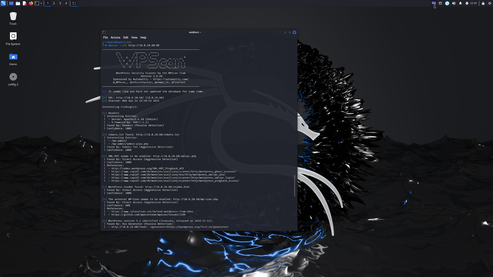

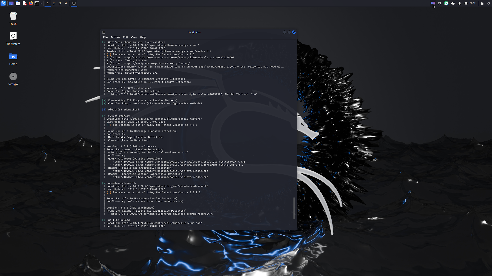

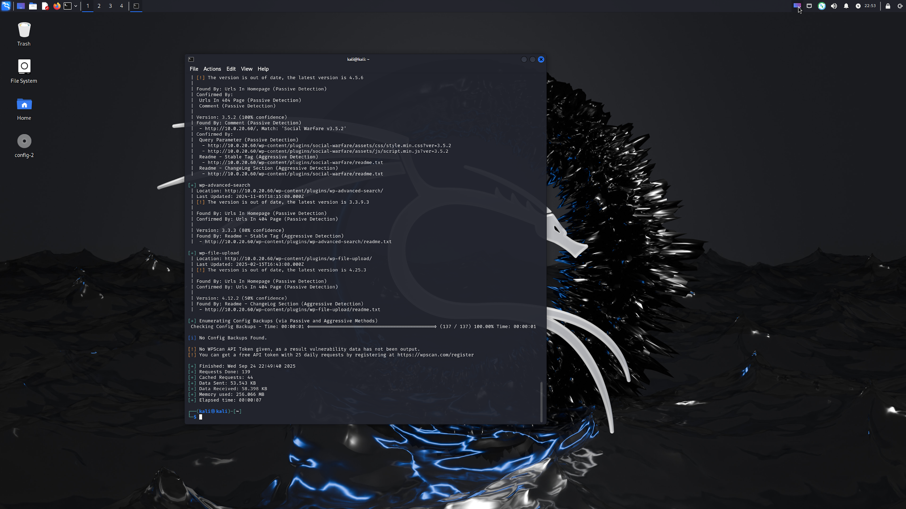

**Сканирование с опциями -e u покажет список привилегированных пользователей в WordPress:**

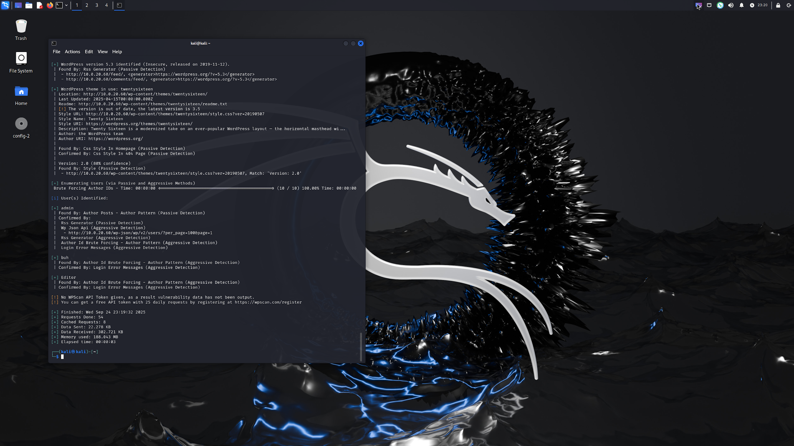

**Видим, что были обнаружены пользователи admin, buh и Editor.**

Также, посмотрим содержимое файла robots.txt по адресу [http://softwaresolutions.acme.skb/robots.txt](http://softwaresolutions.acme.skb/robots.txt):

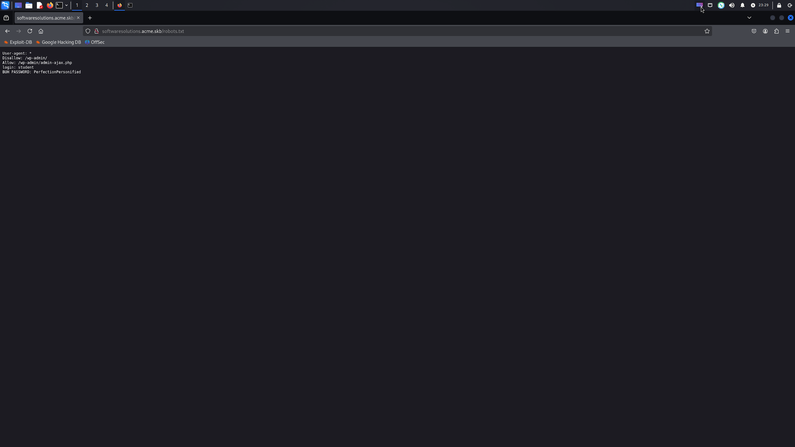

**Далее запустим сканер веб-контента DirBuster:**

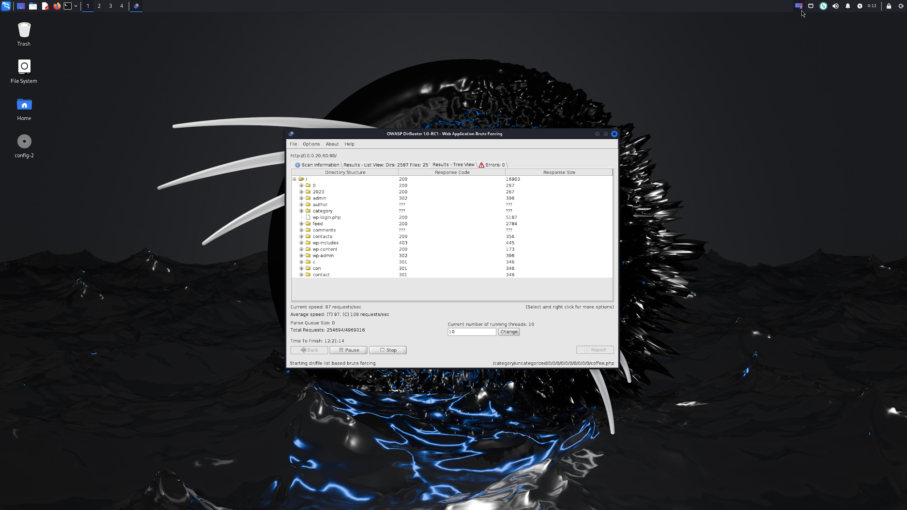

Был использован словарь с большим количеством значений:

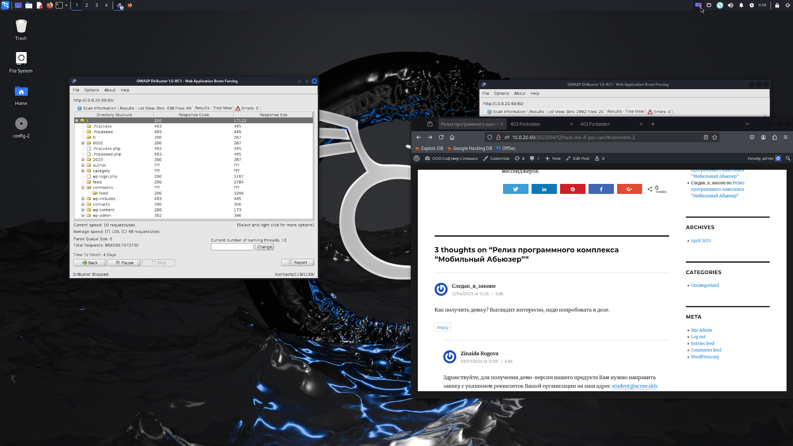

### Описание обнаруженной конфиденциальной информации:

| Название файла | Найденная информация |
| --- | --- |
| WPScan |   |
| Файл robots.txt | Логин: student<br>Buh password: PerfectionPersonified |
| Файл readmi.html | http://10.0.20.60/readme.html |
| Файл wp-cron.php | http://10.0.20.60/wp-cron.php (Файл в WordPress, который обрабатывает запланированные задачи) |
| Тема WordPress | twentysixteen |

## Шаг 5

Попробуем получить доступ к инфраструктуре с помощью сведений, полученных на этапе сбора информации из открытых источников и анализа файловой структуры веб-сервера.

В шаге 3 данного отчета мы выяснили, что у веб-приложения по адресу [http://10.0.20.60](http://10.0.20.60) есть файл robots.txt, который является общедоступным. При открытии этого файла была обнаружена пара логин:пароль – student:PerfectionPersonified. Выполним попытку входа по RDP на машину по адресу http:// 10.0.20.11 с этими данными:

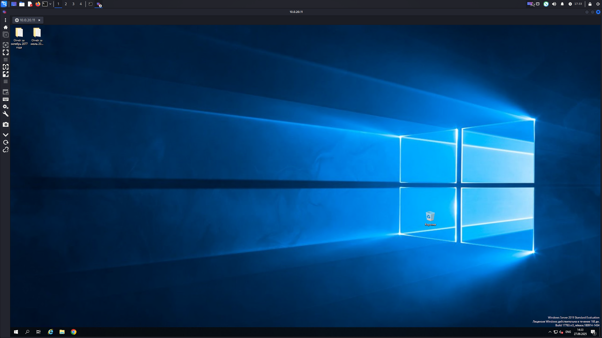

В результате, мы получили доступ в систему компьютера главного бухгалтера. Займемся поиском учетных данных и другой полезной информации, если она присутствует:

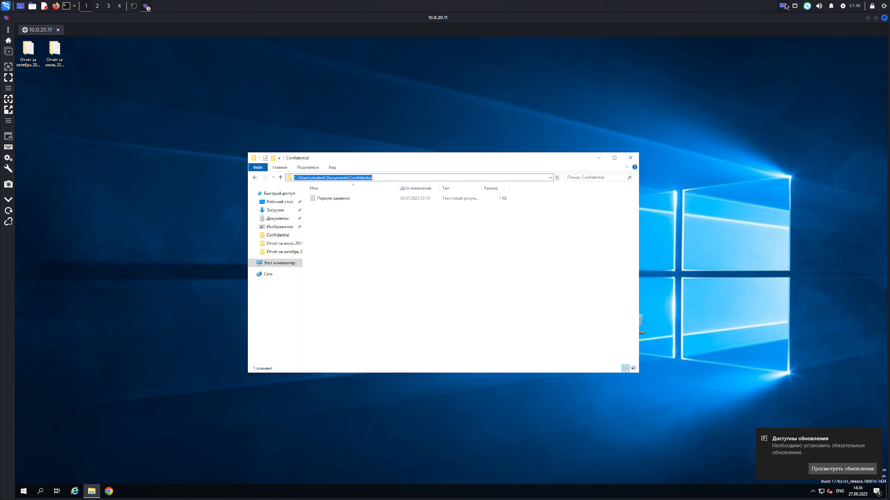

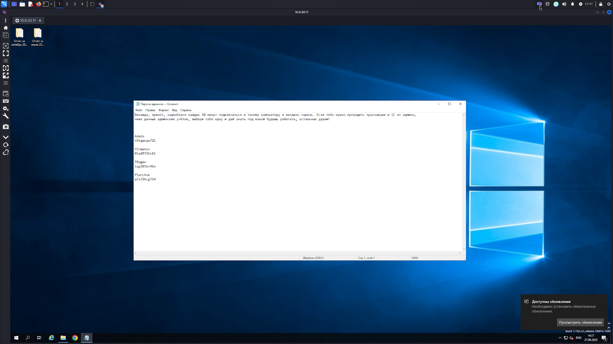

В результате поисков мы обнаружили файл с названием «Пароли админов» по пути C:\Users\student\Documents\Confidential. При просмотре его содержимого были обнаружены несколько учетных записей администратора (4 пары логин/пароль). Судя по описанию, оставленному для бухгалтера, делаем вывод, что из четырех учетных записей рабочая только одна.

Ни на одну машину с данными учетными данными войти не удалось.

Также, на рабочей машине бухгалтера по адресу http:// 10.0.20.11 по пути C:\Users\Admin\.ssh был обнаружен файл с публичным ключом авторизации по протоколу ssh:

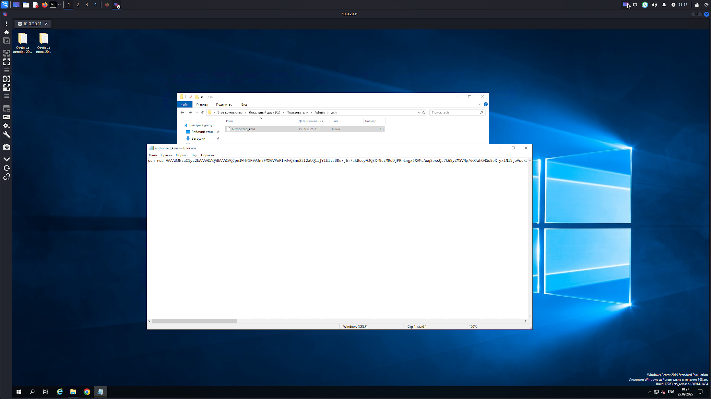

Использовать его не удалось, т.к. порт 22 для службы shh у данной машины закрыт.

- Учётные данные администратора:

| Поле 1 | Поле 2 | Поле 3 | Поле 4 |
| --- | --- | --- | --- |
| Admin<br>n91qwcqw721 | FErmanov<br>01wd972bc61 | TRogov<br>lqg285bv96x | PSarchuk<br>qfo72hcg754 |

- Путь: C:\Users\student\Documents\Confidential.

- Скриншоты: см. выше.

## Шаг 6

### Задание 1

Используя ПО Zenmap, построим граф связей машин исследуемой инфраструктуры. Для начала установим и запустим Zenmap:

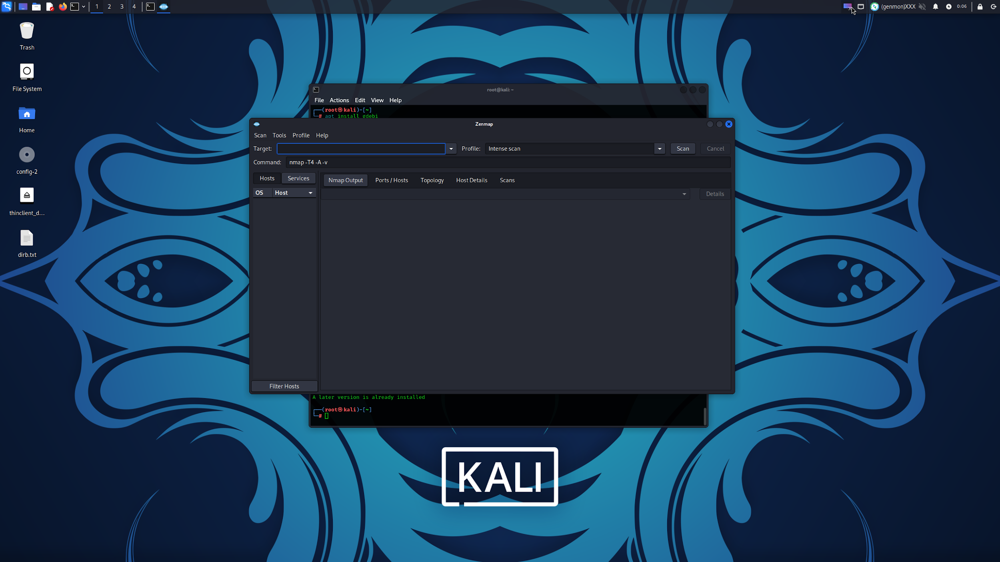

Затем запустим сканирование исследуемой подсети 10.0.20.0/24:

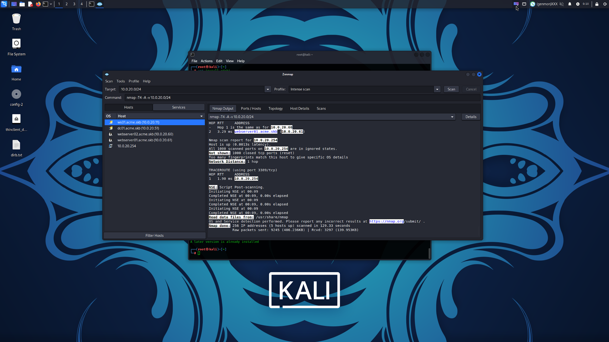

**В результате мы получили следующий граф:**

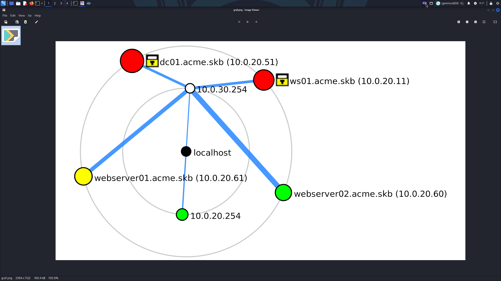

### Задание 2

Используя ПО hydra, подберем пароль к форме аутентификации веб-приложения по адресу http://10.0.20.60. Для этого используем словарь rockyou.txt.

Для правильной атаки требуется правильно составить команду. Для этого откроем страницу для входа и намеренно введем неправильные данные. Далее в браузере перейдем в режим разработчика и найдем строку кода, которая сообщает нам об ошибке аутентификации:

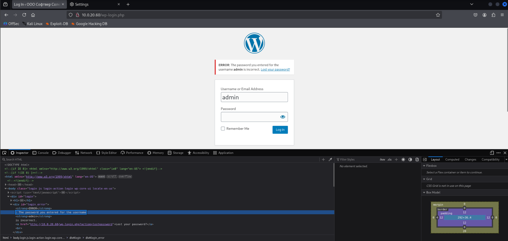

Команда для брутфорса выглядим следующим образом:

```bash
hydra -l admin -P /home/kali/Downloads/rockyou.txt 10.0.20.60 http-post-form "/wp-login.php:log=^USER^&pwd=^PASS^&wp-submit=Log In&testcookie=1:F=The password you entered for the username" -V
```

**Проверим, есть ли наш пароль admin в файле rockyou.txt:**

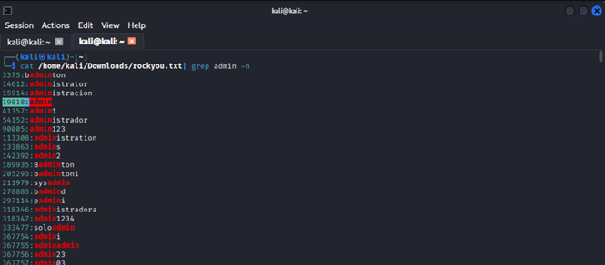

Пароль присутствует, пробуем запустить нашу команду:

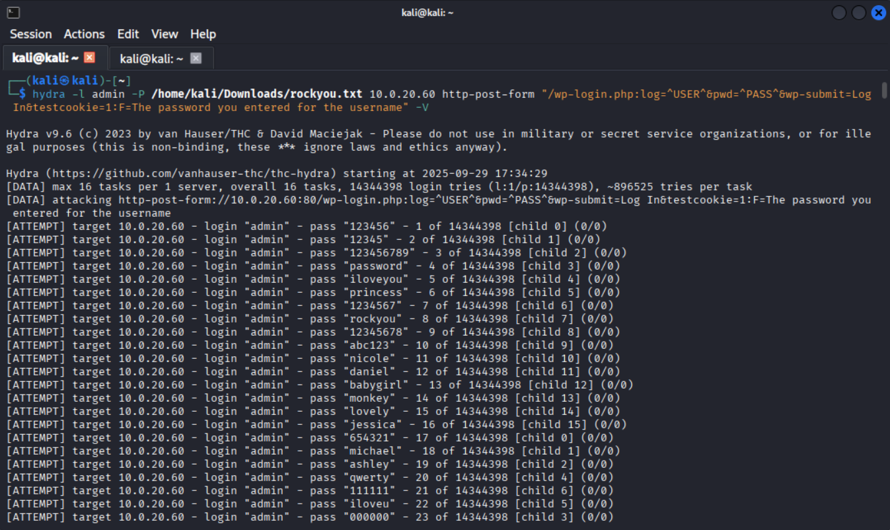

Спустя некоторое время пароль был успешно подобран:

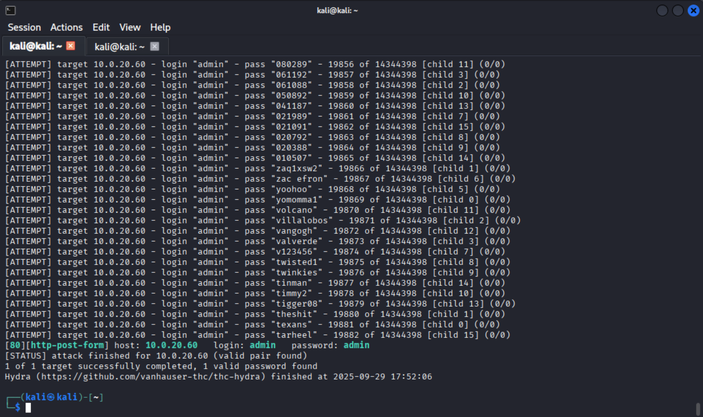

### Задание 3

**Используя ПО patator, подберем пароль учетной записи компьютера главного бухгалтера по адресу http://10.0.20.11 через RDP.**

Зная пару логин:пароль для компьютера бухгалтера (student:PerfectionPersonified) выясним, есть ли данный пароль в нашем словаре rockyou.txt:

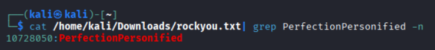

Наш пароль есть и находится на 10.728.050 строчке, следовательно, если правильно задать условия для атаки, patator методом брутфорса подберет его спустя достаточно долгое время. Для удобства перенесем наш пароль PerfectionPersonified в файле rockyou.txt на более раннюю строку, например, на строку 1000:

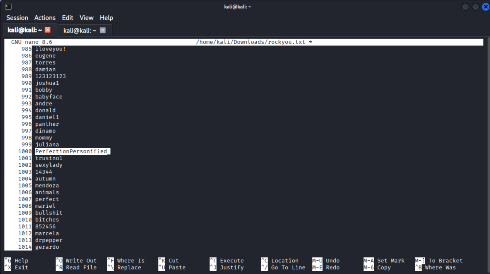

Команда для брутфорса компьютера главного бухгалтера по RDP:

```bash
patator rdp_login host=10.0.20.11 user='student' password=FILE0 0=/home/kali/Downloads/rockyou.txt -x ignore:fgrep='ERRCONNECT'
```

Запустим ее:

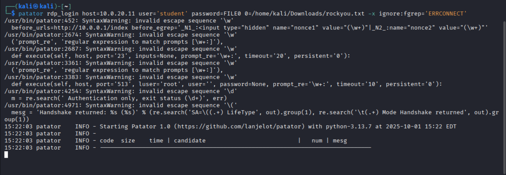

Спустя некоторое время пароль был успешно подобран:

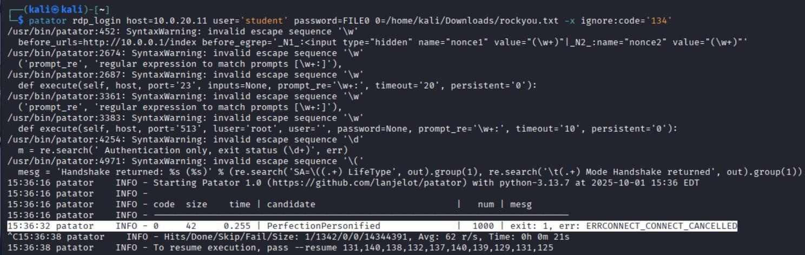

### Задание 4

Получив всю необходимую информацию, используя ПО Maltego, построим графы связей между всеми обнаруженными сущностями (хостами, портами, приложениями, пользователями, паролями и тд.).

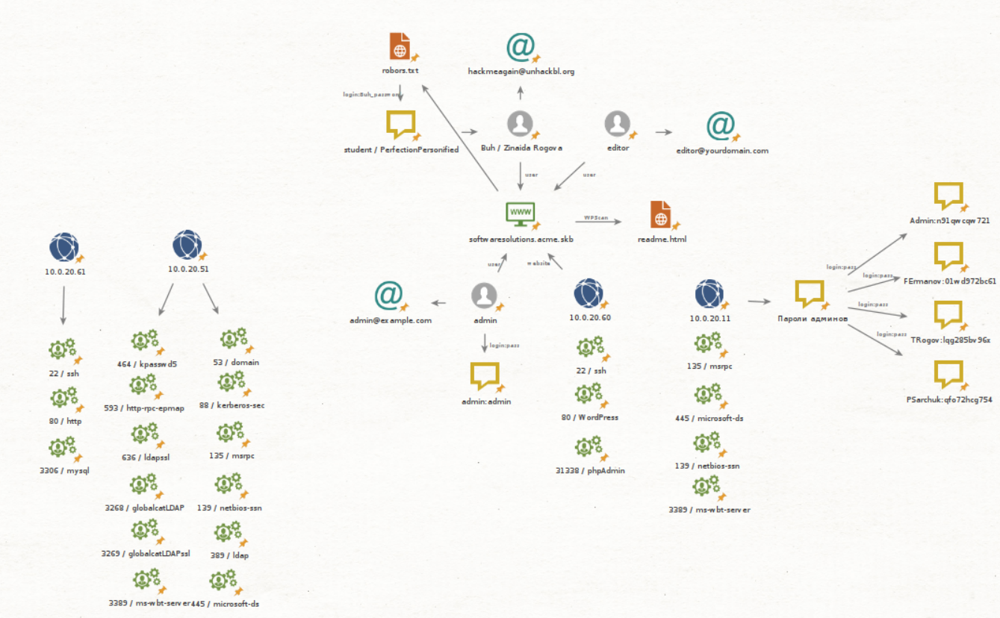

## Шаг 7

### Рекомендации по повышению уровня безопасности инфраструктуры

### Уязвимости с высоким уровнем угрозы и рекомендации

- Уязвимость CVE-2020-15778 (High, CVSS 7.8)

Позволяет удалённому нарушителю выполнить произвольную команду на сервере из-за отсутствия фильтрации специальных символов. Возможна полная компрометация сервера, утечка данных или отказ в работе.
Рекомендации: Применить патч или обновление, отключить неиспользуемые службы удаленного выполнения, усилить сетевую сегрегацию и контроль доступа.

- Уязвимость CVE-2018-19296 и CVE-2020-36326 в библиотеке PHPMailer (High, CVSS 9.8)
Ведут к удалённому выполнению кода через обработку вложений с phar:// путями.
Рекомендации: Обновить PHPMailer до последних версий, проверить и ограничить загрузку вложений, использовать WAF.

- Уязвимости в WordPress до версии 5.3.1 (High, CVSS 9.8)
Позволяют пользователям с низкими правами внедрять JavaScript код, что ведёт к компрометации учётных записей и административного контроля над сайтом.
Рекомендации: Обновить WordPress, ограничить права пользователей, включить плагины безопасности, закрыть административные панели через VPN или IP-блоки.

- Использование устаревших версий PHP (High, CVSS 10.0)
Риск множества уязвимостей: удалённое выполнение кода, DoS, утечка данных.
Рекомендации: Обновить PHP до поддерживаемых версий, регулярно применять безопасности обновления, мониторить журналы безопасности.

- Уязвимость CVE-2023-23397 (Критическая уязвимость в Outlook)
Позволяет злоумышленнику без действий пользователя получить хэши Net-NTLMv2 через SMB, что даёт возможность ретрансляции аутентификации и последующего взлома других систем.
Рекомендации: Обновить Outlook и Windows до последних патчей, ограничить SMB доступ во внешних и ненадёжных сетях.

- Уязвимость CVE-2021-44790 (buffer overflow в Apache HTTP Server mod_lua)
Приводит к удалённому выполнению кода или отказу в обслуживании.
Рекомендации: Обновить Apache до последних версий, ограничить доступ к mod_lua, применить WAF.

- Уязвимость CVE-2021-44223 в WordPress (High, CVSS 9.8)
Позволяет удалённым злоумышленникам выполнять произвольный код через уязвимость цепочки поставок плагинов.
Рекомендации: Проверить и обновить все используемые плагины, удалить неиспользуемые, применить контроль целостности файлов.

- Уязвимость CVE-2023-0567, CVE-2023-0568, CVE-2023-0662 в PHP (High, CVSS ~7.8)
Могут привести к обходу аутентификации, RCE и отказу в обслуживании.
Рекомендации: Обновить PHP, провести аудит аутентификации и управления сессиями.

- Уязвимость CVE-2019-0211 в Apache HTTP Server (High, CVSS 7.8)
Позволяет осуществлять произвольное выполнение кода с правами root через менее привилегированные процессы.
Рекомендации: Обновить Apache, ограничить права на выполнение CGI/скриптов, применять SELinux/AppArmor.

### Уязвимости со средним уровнем угрозы и рекомендации

- CVE-2020-14145, CVE-2016-20012 в OpenSSH (Medium, CVSS 5.3-5.9)
Утечка информации, возможны MITM-атаки и разведка учётных записей.
Рекомендации: Обновить OpenSSH, использовать более сильные протоколы аутентификации (ключи), мониторить логи.

- CVE-2022-31628, CVE-2022-31629 в PHP (Medium, CVSS 6.8)
DoS через исчерпание ресурсов распаковкой файлов.
Рекомендации: Обновить PHP, ограничить загрузку файлов.

- CVE-2021-29447 в WordPress (Medium, CVSS 6.5)
Обход безопасностных ограничений при загрузке файлов.
Рекомендации: Использовать фильтрацию и проверку загрузок, обновить WordPress и плагины.

- CVE-2019-10092 и CVE-2019-10098 в Apache (Medium, CVSS 6.1)
XSS и обход правил безопасности.
Рекомендации: Обновить Apache, конфигурировать политики защиты с помощью WAF.

### Уязвимости с низким уровнем угрозы и рекомендации

- CVE-2020-7068 в PHP (Low, CVSS 3.6)
Use-After-Free, возможны сбои и раскрытие частичной информации.
Рекомендации: Включить мониторинг, обновить PHP по графику.

- CVE-1999-0524 в ICMP (Low, CVSS 2.1)
Раскрытие сетевой информации, возможно проведение DoS-атак.
Рекомендации: Настроить фильтрацию ICMP пакетов на периметре сети.

### Общие рекомендации по безопасности

- Обновлять все серверные ОС и приложения своевременно, применять патчи.

- Закрыть или ограничить доступ к неиспользуемым сервисам и портам (например, SMB 445, NetBIOS 139).

- Усилить аутентификацию, использовать многофакторную аутентификацию.

- Ограничить доступ к административным панелям и чувствительным сервисам.

- Применять системы обнаружения вторжений (IDS/IPS) и WAF.

- Проводить регулярные аудиты уязвимостей и анализ безопасности.

- Обучать пользователей опасностям фишинга и социальной инженерии.

## Шаг 8

### Вывод

В ходе комплексного тестирования безопасности были выявлены многочисленные уязвимости различного уровня критичности в программном обеспечении серверов и веб-приложений. В частности, обнаружены высоко критичные дыры в используемых версиях CMS WordPress, Apache HTTP Server и PHP, дающие злоумышленникам возможность удалённого выполнения кода, обхода механизмов аутентификации, угрозы отказа в обслуживании и компрометации конфиденциальных данных. Кроме того, благодаря использованию стандартных и слабых паролей был получен несанкционированный доступ к важным системам, включая рабочие станции и административные панели.

Результаты демонстрируют, что политика безопасности и поддержка актуальности программного обеспечения в инфраструктуре недостаточна. Недостаточная сегментация сети, незащищённые веб-серверы с открытыми административными интерфейсами и устаревший софт создают высокий риск масштабных атак, включая угрозу компрометации всего периметра.

Общая оценка защищённости: инфраструктура находится на среднем или ниже уровне зрелости безопасности с рядом существенных уязвимостей, которые требуют срочного устранения. Основные риски - удалённое выполнение кода, перехват и расшифровка аутентификационных данных, отказ в обслуживании, а также утечка конфиденциальной информации через Web-уязвимости и административные ошибки. Особое внимание следует уделить обновлению программного обеспечения, усилению контроля доступа, внедрению многофакторной аутентификации и ограничению доступа к административным сервисам.

Таким образом, для снижения рисков необходимо реализовать комплексный план по обновлению уязвимых компонентов, ревизии политик безопасности, усилению сегментации сети и обучению сотрудников основам информационной безопасности. Это позволит значительно повысить устойчивость IT-инфраструктуры к современным киберугрозам и защищённость данных.
