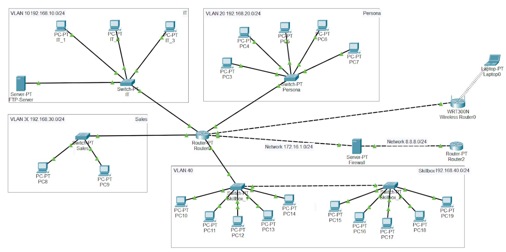

# Проектирование защищённой корпоративной сети

> **Тип проекта:** учебная лабораторная работа  
> **Направление:** сетевая инфраструктура и безопасность  
> **Технологии:** Cisco Packet Tracer, VLAN, Inter-VLAN Routing, Ubuntu, VirtualBox, iptables, FTP, PKI

## Обзор

В рамках проекта была разработана модель корпоративной сети для компании из четырёх отделов. Инфраструктура объединяет 20 рабочих станций, четыре изолированных VLAN, внутренний FTP-сервер, центр сертификации, межсетевой экран и отдельную гостевую Wi-Fi-сеть.

Основная задача проекта — продемонстрировать навыки логического проектирования сети, сегментации, межсетевой маршрутизации и внедрения базовых защитных механизмов.

## Схема сети

## Цели проекта

- Спроектировать корпоративную сеть из 20 персональных компьютеров.
- Разделить подразделения компании на отдельные VLAN.
- Обеспечить связность между разрешёнными сегментами с помощью межVLAN-маршрутизации.
- Развернуть FTP-сервис для авторизованного доступа к внутренним файлам.
- Создать центр сертификации и выпустить сертификаты для подразделений.
- Настроить Ubuntu как межсетевой экран с двумя сетевыми интерфейсами.
- Включить маршрутизацию трафика через Ubuntu и применить три правила `iptables`.
- Организовать отдельный гостевой доступ к сети через Wi-Fi.

## Архитектура и адресация

| Подразделение или сегмент | VLAN | Подсеть | Рабочие станции | Назначение |
|---|---:|---|---:|---|
| IT | 10 | `192.168.10.0/24` | 3 | Администрирование и внутренний FTP-сервер |
| Persona | 20 | `192.168.20.0/24` | 5 | Отдел кадров |
| Sales | 30 | `192.168.30.0/24` | 2 | Отдел продаж |
| SkillBox | 40 | `192.168.40.0/24` | 10 | Офисные рабочие места |
| Гостевая Wi-Fi-сеть | — | На схеме не указана | 1 тестовый клиент | Доступ гостей через беспроводной маршрутизатор |
| Транзитный сегмент фаервола | — | `172.16.1.0/24` | — | Соединение корпоративного маршрутизатора с фаерволом |
| Моделируемая внешняя сеть | — | `8.8.8.0/24` | — | Соединение фаервола с внешним маршрутизатором в лабораторной топологии |

Количество рабочих станций соответствует заданию: `3 + 5 + 2 + 10 = 20`.

## Реализация сети в Cisco Packet Tracer

В Packet Tracer была собрана логическая топология из маршрутизаторов, коммутаторов, рабочих станций, серверов и беспроводного маршрутизатора.

Выполнены следующие работы:

- рабочие станции распределены по четырём функциональным сегментам;
- каждому подразделению назначена отдельная VLAN и подсеть `/24`;
- коммутаторы подразделений подключены к центральному маршрутизатору;
- для офисного сегмента использованы два связанных коммутатора;
- настроена межVLAN-маршрутизация;
- обеспечена сквозная IP-связность между устройствами;
- добавлена отдельная гостевая Wi-Fi-сеть с тестовым беспроводным клиентом;
- в IT-сегменте размещён внутренний сервер;
- в сетевой путь добавлен сервер, выполняющий роль фаервола.

## FTP-сервер

В IT-сегменте был настроен внутренний FTP-сервер. Пользователи сети получили возможность подключаться к сервису и получать доступ к размещённым файлам после авторизации.

Реализация демонстрирует:

- настройку сетевого сервиса внутри отдельного VLAN;
- организацию централизованного доступа к файлам;
- проверку доступности сервера из пользовательских сегментов;
- применение учётных записей для ограничения доступа.

## Центр сертификации

В VirtualBox была развёрнута виртуальная машина Ubuntu, на которой настроен центр сертификации. Для подразделений созданы четыре сертификата:

- `IT`;
- `Persona`;
- `Sales`;
- `SkillBox`.

Эта часть работы охватывает основы инфраструктуры открытых ключей: создание центра сертификации, выпуск сертификатов и разделение сертификатов по функциональным подразделениям.

## Межсетевой экран

Роль фаервола реализована на Ubuntu. В виртуальной машине использовались два сетевых интерфейса, между которыми был включён проброс IP-трафика.

На фаерволе были созданы три правила `iptables` для фильтрации проходящего трафика. Точные выражения правил в исходных материалах не приведены, поэтому в этом README они намеренно не реконструируются.

На схеме Cisco Packet Tracer роль межсетевого экрана обозначена отдельным сервером между корпоративным маршрутизатором и моделируемой внешней сетью.

## Гостевая Wi-Fi-сеть

Для гостевых пользователей добавлен беспроводной маршрутизатор WRT300N и тестовый ноутбук. Этот сегмент предназначен для демонстрации отдельного беспроводного выхода пользователей и не входит в область обязательной защиты согласно условиям задания.

## Проверка работоспособности

После настройки были проверены основные критерии готовности проекта:

- все 20 рабочих станций подключены к своим сегментам;
- VLAN соответствуют назначенным подразделениям;
- устройства имеют IP-связность и отвечают на ICMP-запросы;
- межVLAN-маршрутизация обеспечивает требуемую доступность;
- пользователи могут подключаться к FTP-серверу;
- центр сертификации выпустил четыре сертификата;
- на Ubuntu включён проброс трафика между интерфейсами;
- на фаерволе настроены три правила `iptables`;
- гостевой клиент подключается через Wi-Fi.

## Полученные навыки

- Проектирование логической топологии корпоративной сети
- Планирование IPv4-адресации
- Создание и назначение VLAN
- Настройка межVLAN-маршрутизации
- Работа с Cisco Packet Tracer
- Настройка сетевых сервисов
- Развёртывание FTP-сервера
- Основы PKI и центров сертификации
- Выпуск сертификатов для подразделений
- Настройка Ubuntu с несколькими сетевыми интерфейсами
- Включение IP forwarding
- Создание правил фильтрации в `iptables`
- Проверка сетевой связности и диагностика

## Результат

В результате создана рабочая модель корпоративной сети с логическим разделением подразделений и базовыми средствами защиты. Проект объединяет коммутацию, маршрутизацию, сетевые сервисы, PKI и фильтрацию трафика в единой лабораторной инфраструктуре.

## Возможные улучшения

В дальнейшем проект можно расширить:

- запретить межVLAN-доступ по умолчанию и явно разрешить необходимые соединения;
- изолировать гостевую сеть от внутренних подсетей;
- заменить FTP на защищённый протокол SFTP или FTPS;
- настроить централизованное журналирование событий фаервола;
- добавить DHCP, DNS и NTP;
- использовать отдельный management VLAN;
- добавить резервирование сетевого оборудования;
- внедрить IDS/IPS и мониторинг доступности сервисов;
- документировать конкретную матрицу правил доступа между сегментами.

## Отказ от ответственности

Проект выполнен в изолированной учебной среде. Приведённая топология и адреса используются исключительно для демонстрации навыков проектирования и защиты сетевой инфраструктуры.
